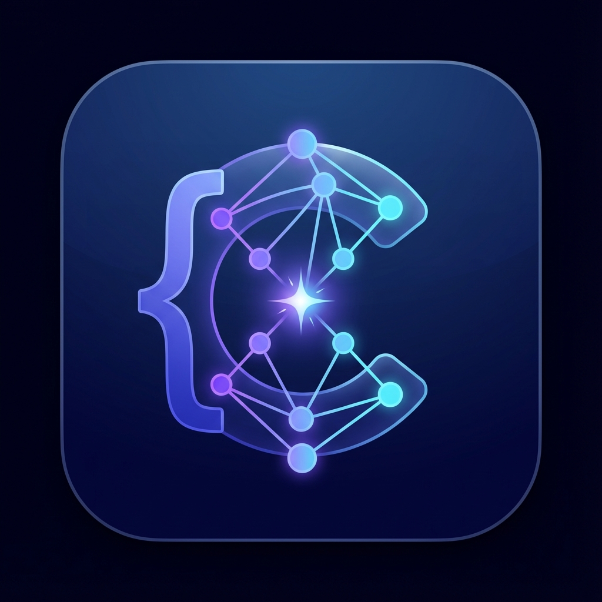

# 🚀 Cordex - 开源免费的 AI 编程助手

<div align="center">



**一款完全开源、免费的 AI 编程助手，向 Cursor 致敬！**

[](LICENSE)
[](https://github.com/Ricardo-M-L/cordex/stargazers)
[](https://github.com/Ricardo-M-L/cordex/issues)

[English](README_EN.md) | 简体中文

</div>

---

## ✨ 特性

### 🎯 核心功能

- **🆓 完全免费开源** - Apache 2.0 协议，无需订阅
- **🤖 多 AI 模型支持** - OpenAI、Claude、DeepSeek、Qwen、Gemini、Ollama
- **🖼️ 图片上传** - 支持在对话中上传图片进行分析
- **🎤 语音输入** - 支持语音转文字输入
- **⏹️ 停止生成** - 可随时中断 AI 输出
- **📝 Monaco 编辑器** - VS Code 同款编辑器内核
- **💻 集成终端** - 内置终端模拟器
- **🎨 现代化 UI** - 基于 Tailwind CSS 的精美界面

### 🤖 支持的 AI 模型

#### OpenAI
- GPT-4o
- GPT-4 Turbo
- GPT-4
- GPT-3.5 Turbo

#### Anthropic (Claude)
- Claude Sonnet 4.5 ⭐ 最新
- Claude 3.5 Sonnet
- Claude 3 Opus
- Claude Haiku 4 ⭐ 最新
- Claude 3 Haiku

#### DeepSeek
- DeepSeek Chat (V3)
- DeepSeek Coder

#### Qwen (通义千问)
- Qwen Max
- Qwen Plus
- Qwen Turbo

#### Google Gemini
- Gemini 2.0 Flash ⭐ 最新
- Gemini 1.5 Pro
- Gemini 1.5 Flash

#### Ollama (本地模型)
- 支持所有 Ollama 模型
- 完全离线运行
- 数据隐私保护

---

## 🚀 快速开始

### 安装

#### 方式一：下载安装包（推荐）

前往 [Releases](https://github.com/Ricardo-M-L/cordex/releases) 页面下载最新版本：

- **macOS**: `Cordex-1.0.0-mac.dmg`
- **Windows**: `Cordex-1.0.0-win.exe` (即将推出)

#### 方式二：从源码构建

```bash
# 克隆项目
git clone https://github.com/Ricardo-M-L/cordex.git
cd cordex

# 安装依赖
npm install

# 开发模式
npm run dev

# 打包应用
npm run build:mac    # macOS
npm run build:win    # Windows
```

### 配置

1. 打开 Cordex 应用
2. 点击右上角的设置图标 ⚙️
3. 选择 AI 提供商
4. 输入对应的 API Key
5. 选择模型并保存

#### API Key 获取

- **OpenAI**: [platform.openai.com](https://platform.openai.com/api-keys)
- **Anthropic**: [console.anthropic.com](https://console.anthropic.com/)
- **DeepSeek**: [platform.deepseek.com](https://platform.deepseek.com/)
- **Qwen**: [阿里云百炼控制台](https://bailian.console.aliyun.com/)
- **Gemini**: [Google AI Studio](https://aistudio.google.com/app/apikey)
- **Ollama**: 本地运行，无需 API Key

---

## 🛠️ 技术栈

```
📦 Cordex 技术栈
├── 🖥️  桌面端: Electron 28
├── ⚛️  前端: React 18 + TypeScript
├── 🎨  样式: Tailwind CSS
├── 📝  编辑器: Monaco Editor
├── 🤖  AI SDK:
│   ├── @anthropic-ai/sdk
│   ├── openai
│   └── ollama
├── 💻  终端: Xterm.js
└── 📦  构建: Vite + electron-vite
```

---

## 📸 界面预览

### 主界面
- **左侧**: 文件树导航
- **中间**: 代码编辑区域
- **右侧**: AI 对话面板

### 核心功能
- ✅ 实时流式输出
- ✅ Markdown 渲染
- ✅ 代码高亮
- ✅ 图片上传分析
- ✅ 语音输入
- ✅ 停止生成

---

## 🆚 对比

### vs Cursor

| 特性 | Cordex | Cursor |
|------|--------|--------|
| **价格** | 完全免费 | $20/月 |
| **开源** | ✅ Apache 2.0 | ❌ 闭源 |
| **本地模型** | ✅ 支持 Ollama | ❌ 仅云端 |
| **多模型** | ✅ 6+ 提供商 | ⚠️ 有限 |
| **图片上传** | ✅ 支持 | ✅ 支持 |
| **语音输入** | ✅ 支持 | ❌ 不支持 |

---

## 🗺️ 路线图

- [x] 多 AI 模型支持
- [x] 图片上传功能
- [x] 语音输入
- [x] 停止生成
- [ ] 项目文件管理
- [ ] 代码重构建议
- [ ] 主题切换
- [ ] 插件系统
- [ ] Linux 支持

---

## 🤝 贡献

欢迎任何形式的贡献！

1. Fork 项目
2. 创建特性分支 (`git checkout -b feature/AmazingFeature`)
3. 提交改动 (`git commit -m 'Add some AmazingFeature'`)
4. 推送分支 (`git push origin feature/AmazingFeature`)
5. 提交 Pull Request

---

## 📄 开源协议

本项目采用 [Apache License 2.0](LICENSE) 开源协议。

---

## 🙏 致谢

感谢以下优秀项目：

- [Electron](https://www.electronjs.org/)
- [React](https://react.dev/)
- [Monaco Editor](https://microsoft.github.io/monaco-editor/)
- [Anthropic Claude](https://www.anthropic.com/)
- [OpenAI](https://openai.com/)
- [Ollama](https://ollama.ai/)
- [Tailwind CSS](https://tailwindcss.com/)

---

## 📞 联系

- **GitHub**: [@Ricardo-M-L](https://github.com/Ricardo-M-L)
- **Issues**: [提交问题](https://github.com/Ricardo-M-L/cordex/issues)
- **Discussions**: [参与讨论](https://github.com/Ricardo-M-L/cordex/discussions)

---

<div align="center">

**如果觉得 Cordex 对你有帮助，请给个 ⭐ Star 支持一下！**

Made with ❤️ by [Ricardo-M-L](https://github.com/Ricardo-M-L)

</div>
